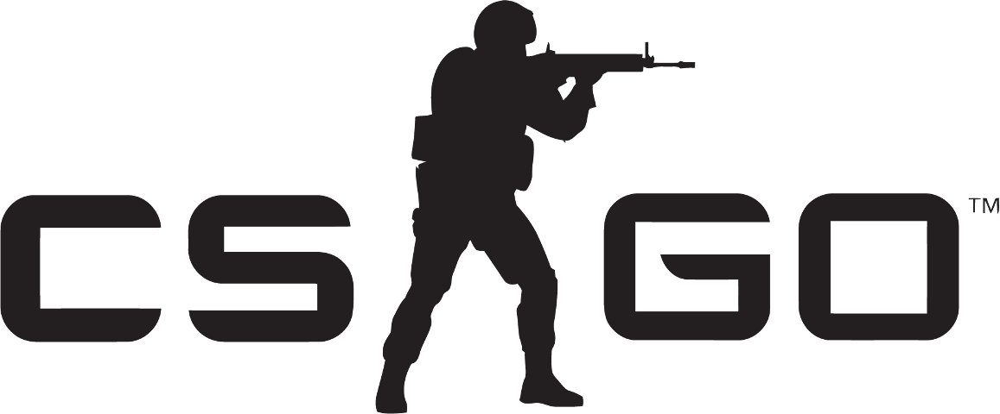
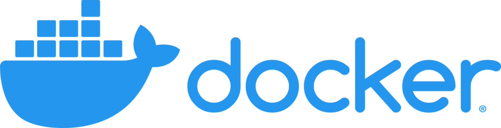

<h1 align="center">
 
 
</h1>
<h1 align="center">
 csgo-docker
</h1>
<p align="center">
 <em>
  Quickly deploy a dedicated CS:GO server for a competitive match
 </em>
</p>

<p align="center">
 <a href="https://github.com/theo-brown/csgo-docker/blob/main/LICENSE">
  
 </a>
 
</p>


## Contents

1. [Introduction](#1-introduction)

2. [Using the image](#2-using-the-image)

    2.1 [Quickstart](#21-quickstart)

    2.2 [Recommended Docker launch arguments](#22-recommended-docker-launch-arguments)

    2.3 [Examples](#23-examples)

3. [Environment variables](#3-environment-variables)

4. [Using Get5 for match creation](#4-using-get5-for-match-creation)

    4.1 [Match config schema](#41-match-config-schema)

    4.2 [Team schema](#42-team-schema)

5. [Keeping the image up to date](#5-keeping-the-image-up-to-date)


## 1. Introduction

This image aims to provide a CS:GO server that can **run a competitive match straight out of the box**, with no setup required beyond setting the match parameters.

Everything that can be changed about the server can be **set using environment variables** passed to Docker on container creation.

[Get5](https://github.com/splewis/get5) is used to set up and manage the match - for further information as to how it works please read
[Using Get5 for match creation](#using-get5-for-match-creation). If you need more detail have a look at the [Get5 documentation](https://github.com/splewis/get5).

This Docker image draws heavily on [CM2Walki's CSGO Docker image](https://github.com/CM2Walki/CSGO).


## 2. Using the image

### 2.1 Quickstart

1. Download the image from [Docker hub](https://hub.docker.com/r/theobrown/csgo-server):
```
docker pull theobrown/csgo-server:latest
```

2. Launch a container:
```
docker run --network=host theobrown/csgo-server:latest
```

### 2.2 Recommended Docker launch arguments

At minimum, you'll probably want to launch the container with the following environment variables set:

* `--network=host`: use the host machine's ports and IP address, rather than running within an isolated Docker network that's not visible to the outside world.

* `-e PASSWORD=<some password>`: set the password to connect to the server.

* `-e RCON_PASSWORD=<some other password>`: set the RCON (admin) password.

* `-e GOTV_PASSWORD=<another password>`: set the GOTV password.

* `-e SERVER_TOKEN=<your GSLT>`: set a Game Server Login Token so that the server can be connected to by non-LAN clients (see [below](#environment-variables)).

If you want to start the server with a loaded config, set:

* `-e MATCH_CONFIG=<your match config>`: start the server with the given JSON config loaded with Get5.

### 2.3 Examples

#### 2.3.1 Starting a server with no match config

Start a server using the host machine's IP address, with the specified port, GOTV port, password, RCON password, GOTV password, and (made up) server token (generate a real one [here](https://steamcommunity.com/dev/managegameservers)).

```
docker run --network=host \
 -e PORT=1234 \
 -e GOTV_PORT=1235
 -e PASSWORD=mypass \
 -e RCON_PASSWORD=adminpass \
 -e GOTV_PASSWORD=gotvpass \
 -e SERVER_TOKEN=A1B2C3D4E5F6G7H8I9J0 \
 theobrown/csgo-server:latest
```

Any player can connect to the server and type `!get5` in chat to set up a match.

If the host machine had public IP `251.131.41.166` then running the following command in the CS:GO in-game console would connect to the server:
```
connect 251.131.41.166:1234; password mypass 
```

Running the following command in the CS:GO in-game console would connect to the GOTV stream:
```
connect 251.131.41.166:1235; password gotvpass
```

#### 2.3.2 Starting a server with a match config with veto

Start a server using the host machine's IP address, the default port, the specified password, RCON password, GOTV password, and server token, and load the given Get5 config.
Once the players are connected and ready up, the map veto will start. Once the veto is complete, the game will begin.
```
docker run --network=host \
 -e PASSWORD=mypass \
 -e RCON_PASSWORD=adminpass \
 -e GOTV_PASSWORD=gotvpass \
 -e SERVER_TOKEN=A1B2C3D4E5F6G7H8I9J0 \
 -e MATCH_CONFIG="{'matchid': '81a99ef9a2844c278c2bda2f5a77a793', \
                   'num_maps': 3, \
                   'maplist': ['de_dust2', 'de_inferno', 'de_mirage', 'de_nuke', 'de_overpass', 'de_train', 'de_vertigo'], \
                   'skip_veto': False, \
                   'team1': {'name': 'Astralis', \
                             'tag': 'AST', \
                             'players': {698652696634933762: 'gla1ve', \
                                         234783204182937471: 'Magisk', \
                                         389371614622221912: 'dev1ce', \
                                         951311418417028314: 'dupreeh', \
                                         369417162788295143: 'Xyp9x'}}, \
                   'team2': {'name': 'Natus Vincere', \
                             'tag': 'NAVI', \
                             'players': {875407653610178066: 's1mple', \
                                         979550479724346962: 'Boombl4', \
                                         186841562108230104: 'electronic', \
                                         726408891643982724: 'Perfecto', \
                                         512316566954794515: 'flamie'}}}" \
 theobrown/csgo-server:latest
```

#### 2.3.3 Starting a server with a match config with no veto

Start a server using the host machine's IP address, the default port, the specified password, RCON password, GOTV password, and server token, and load the given Get5 config.
Once the players are connected and ready up, the game will begin.

```
docker run --network=host \
 -e PASSWORD=mypass \
 -e RCON_PASSWORD=adminpass \
 -e GOTV_PASSWORD=gotvpass \
 -e SERVER_TOKEN=A1B2C3D4E5F6G7H8I9J0 \
 -e MATCH_CONFIG="{'matchid': '81a99ef9a2844c278c2bda2f5a77a793', \
                   'num_maps': 3, \
                   'maplist': ['de_dust2', 'de_inferno', 'de_overpass'], \
                   'skip_veto': True, \
                   'map_sides': ['team1_ct', 'team2_ct', 'knife'], \
                   'team1': {'name': 'Astralis', \
                             'tag': 'AST', \
                             'players': {698652696634933762: 'gla1ve', \
                                         234783204182937471: 'Magisk', \
                                         389371614622221912: 'dev1ce', \
                                         951311418417028314: 'dupreeh', \
                                         369417162788295143: 'Xyp9x'}}, \
                   'team2': {'name': 'Natus Vincere', \
                             'tag': 'NAVI', \
                             'players': {875407653610178066: 's1mple', \
                                         979550479724346962: 'Boombl4', \
                                         186841562108230104: 'electronic', \
                                         726408891643982724: 'Perfecto', \
                                         512316566954794515: 'flamie'}}}" \
 theobrown/csgo-server:latest
```


## 3. Environment variables

Setting environment variables when starting a container allows you to manipulate the launch options of the server.

For example, `docker run -e PASSWORD=1234 theobrown/csgo-server:latest` will start a new server with password `1234` by launching the server with `+sv_password 1234`. 

All possible environment variables are displayed in the table below.

| Variable name            | Launch option               | Description                                                                            
| :----------------------- | :-------------------------- | :-------------------------------
| SERVER_TOKEN             | `+sv_setsteamaccount`       | The Steam Game Server Login Token for this instance, required for the server to be accessible to non-LAN connections. Generate one [here](https://steamcommunity.com/dev/managegameservers) (default: not set, ie LAN connections only).
| PASSWORD                 | `+sv_password`              | Password required to connect to the server (default: not set)
| RCON_PASSWORD            | `+rcon_password`            | Password required to establish an RCON (remote console) connection to the server (default: not set)
| PUBLIC_ADDRESS           | `+net_public_adr`           | Set the public IP of the server (default: not set, defaults to your host machine's public IP if run with `--network=host`)
| PORT                     | `-port`                     | Server port (default: 27015)
| GOTV_PORT                | `+tv_port`                  | GOTV port (default: 27020)
| GOTV_PASSWORD            | `+tv_password`              | GOTV password (default: not set)
| CLIENT_PORT              | `+clientport`               | Specify the port that the server advertises to clients (default: not set). I'm not entirely sure what this does, so maybe just leave it unset.
| TICKRATE                 | `-tickrate`                 | Server tick rate (64 or 128; default: 128)
| MAXPLAYERS               | `-maxplayers_override`      | Limit how many players the server can contain (default: 30)
| GAMETYPE                 | `+game_type`                | Use GAMETYPE and GAMEMODE to set what game mode is played (default: GAMETYPE=0, GAMEMODE=1, which sets game mode to competitive). Note this will be overriden by Get5.
| GAMEMODE                 | `+game_mode`                | See above.
| MAPGROUP                 | `+mapgroup`                 | The map group to cycle through. Given this will be overridden by Get5, probably leave it as default (default: mg_active).
| MAP                      | `+map`                      | The map that the server starts on. Must be a valid CSGO map, e.g. `de_mirage`. 
| HOST_WORKSHOP_COLLECTION | `+host_workshop_collection` | Set the maps in specified workshop collection as the server's map list (default: not set)
| WORKSHOP_START_MAP       | `+workshop_start_map`       | Get the latest version of the workshop map with the specified ID and set it as the starting map (default: not set)
| WORKSHOP_AUTHKEY         | `-authkey`                  | Set a Steam Web API authkey, required to download maps from the workshop. Generate one [here](https://steamcommunity.com/dev/apikey) (default: not set).
| AUTOEXEC                 | `+exec`                     | A `.cfg` file to be executed on startup. Note anything you set here will probably be overwritten by Get5 when a match is loaded, so it's fairly useless (default: not set).
| MATCH_CONFIG             |                             | If set to a valid JSON match config, the server starts with the config loaded. If not set, the server starts with `get5_check_auths 0`. [See below](#using-get5-for-match-creation) for more on using Get5. (Default: not set.)


Launch options are appended to the following set of basic launch options that are passed as arguments to `srcds`, the dedicated server program:
```
-game csgo -console -autoupdate -usercon
```


## 4. Using Get5 for match creation

*This section is mostly directly copied from [Get5's README](https://github.com/splewis/get5/blob/master/README.md)*

Get5 uses JSON-formatted objects to create matches. These set the players who are allowed on the server, the maps to be played, the sides, etc.

The image can start a container with or without a match config, by setting the optional environment variable `MATCH_CONFIG` or leaving it unset.

If started with a match config, only the players specified in the config will be able to connect.
If started with no match config, then any player can connect, and once connected the command `get5_creatematch` needs to be run in console (or `!get5` sent in chat) to set up a match.

### 4.1 Match Config Schema

Of the below fields, only the team1 and team2 fields are actually required. Reasonable defaults are used for other fields (bo3 series, 5v5, empty strings for team names, etc.)

| Element                    | Description 
| :------------------------- | :--------------------- 
| `matchid`                  | A string used to identify the match
| `num_maps`                 | Number of maps in the series. This must be an odd number or 2.
| `maplist`                  | An odd-length array of strings identifying the maps to use.
| `skip_veto`                | If true, the veto will be skipped and the maps will come from the maplist in the order given. If false, use Get5's built in veto menu.
| `veto_first`               | Either `"team1"`, or `"team2"`. If not set, or set to any other value, team 1 will veto first.
| `side_type`                | Either `"standard"` (team that didn't pick the map chooses which side to start on), `"never_knife"` (team1 starts as CT), or `"always_knife"` (play a knife round at the beginning of each map)
| `map_sides`                | If `skip_veto` is true, then the starting sides for each map need to be set here in an array of strings. Possible values: `"team1_t"`, `"team1_ct"`, `"team2_t"`, `"team2_ct"`, `"knife"`.
| `players_per_team`         | Maximum number of players per team, excluding coach (default: 5)
| `min_players_to_ready`     | Minimum number of connected players a team needs to be able to ready up (default: 1)
| `favored_percentage_team1` | Predicted percentage probability that team1 win (wrapper for mp_teamprediction_pct), displayed in GOTV.
| `favored_percentage_text`  | Text to accompany the prediction percentage displayed in GOTV (wrapper for mp_teamprediction_txt)
| `cvars`                    | Cvars to be set during the match warmup/knife round/live state
| `spectators`               | See the team schema below (only the players and name sections are used for spectators)
| `team1`                    | See the team schema below
| `team2`                    | See the team schema below

### 4.2 Team Schema

| Element        | Description
| :------------- | :---------------------
| `name`         | Team name (optional)
| `tag`          | Team tag - replaces client clan tags (optional)
| `flag`         | 2 letter country code to set the team's flag (optional)
| `logo`         | Team logo (optional)
| `players`      | Either an array of steamids or, to override in-game player names, a dictionary of steamids to names (**required**)
| `series_score` | Current score in the series. This can be used to give a team a map advantage (default: 0)


## 5. Keeping the image up to date

The script `image_update/image_updater_remote.sh` is run on a server as a `cron` job, to periodically check for CS:GO updates.
If the version of CS:GO installed on the image differs from the latest version of CS:GO according the Steam Web API, then the script `server-scripts/server_update.sh` is run within the container.
The changes are committed to the image, the image label updated to show the latest version of CS:GO installed, and the image pushed to the registry.

Consequently, the image on the registry should always be running the latest version of CS:GO. The update-push process can take a while, so it may be a little delayed.

If you urgently need to use the image without waiting for the registry image to update or to avoid re-downloading from the registry, you have two options.

1. Do nothing, and continue to start containers as you would normally. As the CS:GO server is launched with the `-autoupdate` flag, it will check for updates on launch.
The downside of this approach is that every new container instance will have to redownload the update, leading to slower start-up times.

2. Update your local copy of the image using `image_update/image_updater_local.sh`. This ensures that every container will run with an up-to-date copy of CS:GO.

The image updater scripts use `jq` to parse JSON objects from the Steam Web API. Install it using `sudo apt install jq`.
